# UA Bouffe API
[](https://github.com/ungdev/UA-bouffe-api/actions/workflows/ci.yml)

API du microservice [UA Bouffe](https://github.com/ungdev/UA-bouffe)

## Installation
### Prérequis
- NodeJS
- Pnpm
- MySQL
### Base de données
Créer la base de données uabouffe
```
CREATE DATABASE uabouffe CHARACTER SET utf8;
```
### Installation de l'API et des dépendances

Il faut maintenant clone le repo [UA-bouffe](https://github.com/ungdev/UA-bouffe) (avec les submodules) qui contient un jeu de données à mettre dans la DB.
```
git clone https://github.com/ungdev/UA-bouffe-api
cp .env.example .env
pnpm i
```
## Développement
### Démarrer l'API en développement
```
pnpm dev
```
### Avant de commit
Afin de garder une certaine cohérence dans le code, on utilise EsLint et Prettier. Il faut donc bien lint le code avant de commit
```
pnpm lint-fix
```
### Démarrer l'API en production
```
pnpm build
pnpm start
```

Dans le Dockerfile, il faut aussi rajouter l'argument `--build-arg API_URI=http://x.x.x.x:port` à la commande `pnpm build`, en mettant l'IP et le port de l'API.

### CI/CD
La pipeline de CI/CD est assurée par GitHub Actions.

A chaque push sur master, GitHub Action lint le code, le build et trigger okd pour déployer le code en production ainsi que Slack pour notifier l'avancée de la vérification
Il se passe en moyenne 5 minutes entre un push et un déploiement.

### Diagramme de séquence lors d'une commande


### Licence
Le code est sous licence MIT.
